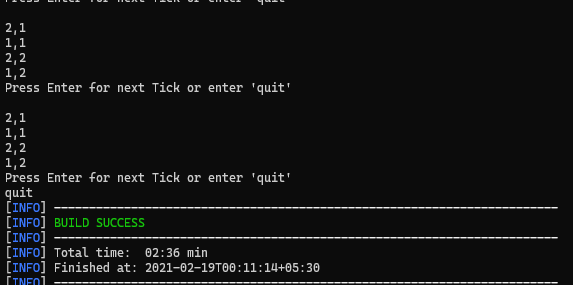

# Game of Life

--------------------------------------------------

## Table of contents:

* [Description](https://github.com/kashyapbari/game-of-life#description)
* [Tech stack](https://github.com/kashyapbari/game-of-life#tech-stack)
* [Development](https://github.com/kashyapbari/game-of-life#development)

--------------------------------------------------

## Description

The universe of the Game of Life is an infinite two-dimensional orthogonal grid of square cells, each of which is in one of two possible states, live or dead. 
Every cell interacts with its eight neighbours, which are the cells that are directly horizontally, vertically, or diagonally adjacent.

### At each step in time, the following transitions occur:
1. Any live cell with fewer than two live neighbours dies, as if by loneliness.
2. Any live cell with more than three live neighbours dies, as if by overcrowding.
3. Any live cell with two or three live neighbours lives, unchanged, to the next generation.
4. Any dead cell with exactly three live neighbours comes to life.

### Each generation is a pure function of the one before:
At the beginning an initial state input is given by the user, also called the seed.

A generation is created by applying the above rules simultaneously to every cell in the seed - births and deaths happen simultaneously, and the discrete moment at which this happens is called a tick.

### Input and Ouput
* Input is the seed data used for initial state taken in form of [Sparse Matrix](https://en.wikipedia.org/wiki/Sparse_matrix).

* Similarly Output is represented in a Sparse Matrix after each tick

### Example
Pattern |Input | Output
--- |--- | ---
|Block pattern <br>Still life |1, 1<br>1, 2<br>2, 1<br>2, 2|1, 1<br>1, 2<br>2, 1<br>2, 2|
|Boat pattern <br>Still life | 0, 1<br>1, 0<br>2, 1<br>0, 2<br>1, 2|0, 1<br>1, 0<br>2, 1<br>0, 2<br>1, 2|
|Blinker pattern <br> oscillator |1, 1<br>1, 0<br>1, 2|1, 1<br>0, 1<br>2, 1|
|Toad pattern <br>two phase oscillator|1, 1<br>1, 2<br>1, 3<br>2, 2<br>2, 3<br>2, 4|0, 2<br>1, 1<br>1, 4<br>2, 1<br>2, 4<br>3, 3|


--------------------------------------------------

### Tech stack:

##### 1. JDK 11

##### 2. Gradle

##### 3. Junit5

--------------------------------------------------

### Development

#### 1. Running the app locally:

##### Navigate to `root` folder of workspace and execute below command

###### 1.1 Build
```shell
./mvnw clean install
```
###### 1.2 Run
```shell
./mvnw exec:java
```


#### 2. Running tests:

```shell
./mvnw clean test
```
### Using the App

#### User Input

##### 1. On running the app as mentioned above you will be prompted to enter the Initial State of the Universe.
This is where you provide cell locations of all the alive cells.
* Cell row and columns are separated  by ','
* Each cell is entered on the next time
* When you are done entering seed data press enter to leave a line empty this will start the first tick


##### 2. Reading Output
After every Tick output will be printed on the console.
* Cell row and column separated  by ',' and each cell on new line
* To play the next Tick simply press Enter.
* To quit enter 'quit' in the console


